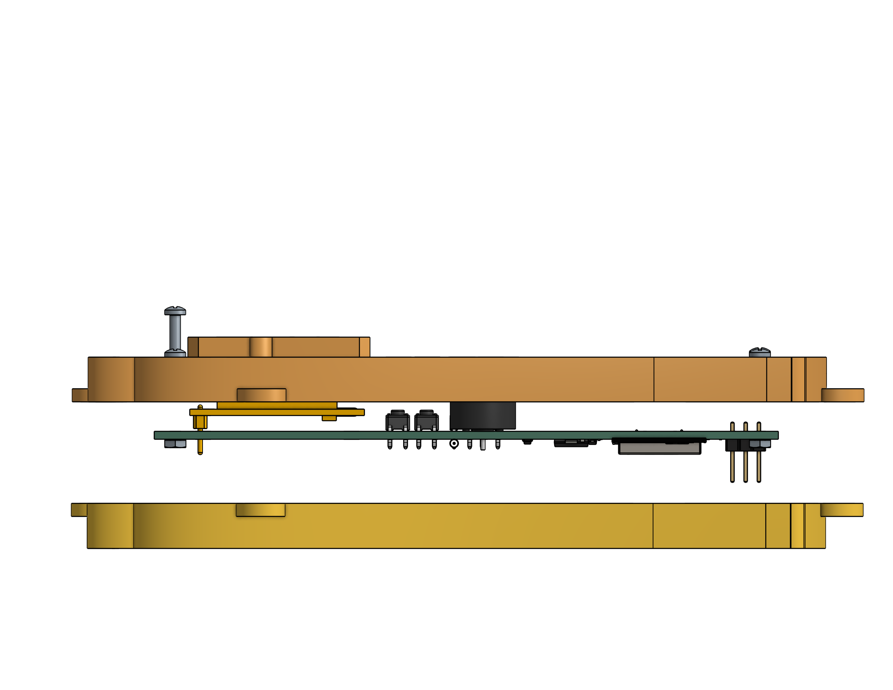
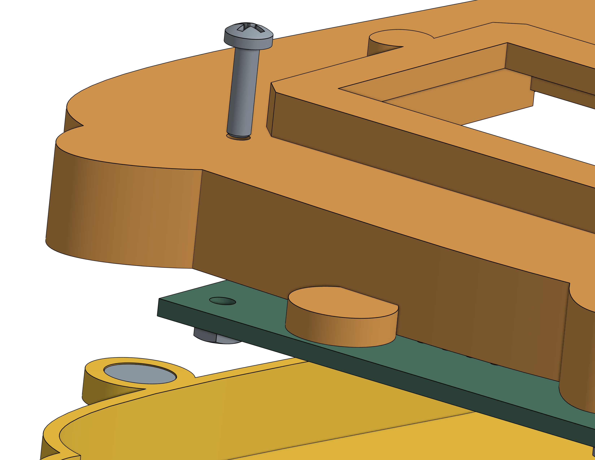
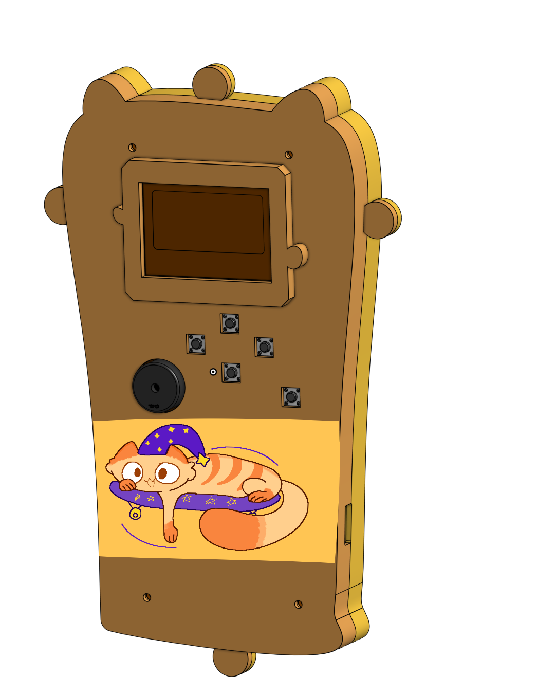
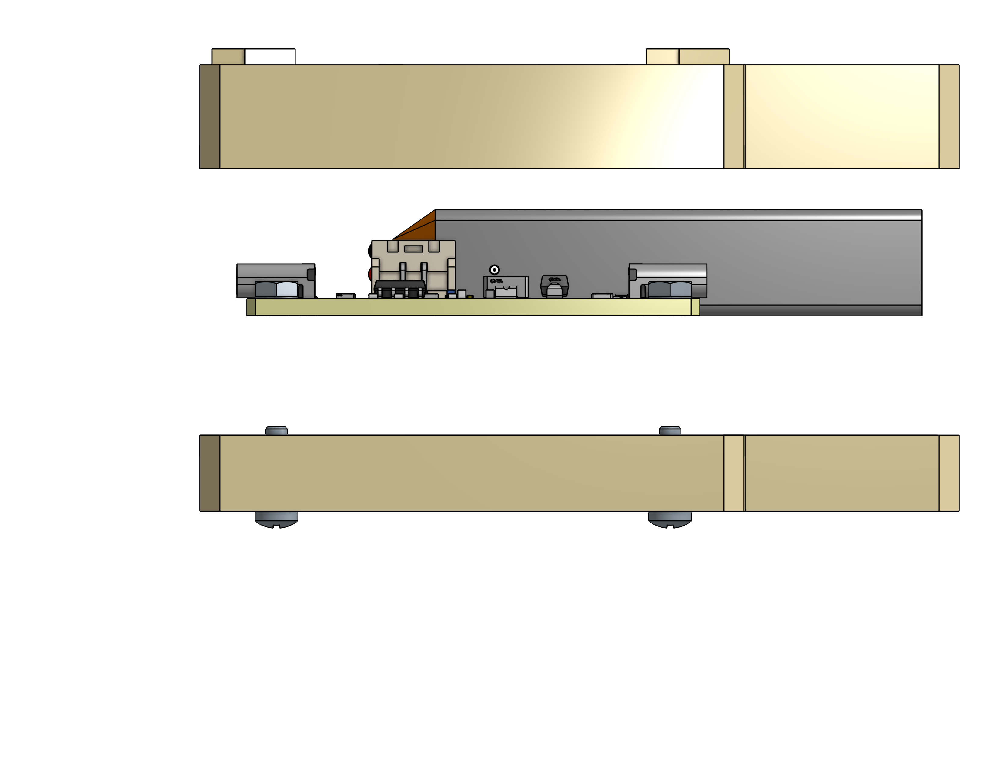
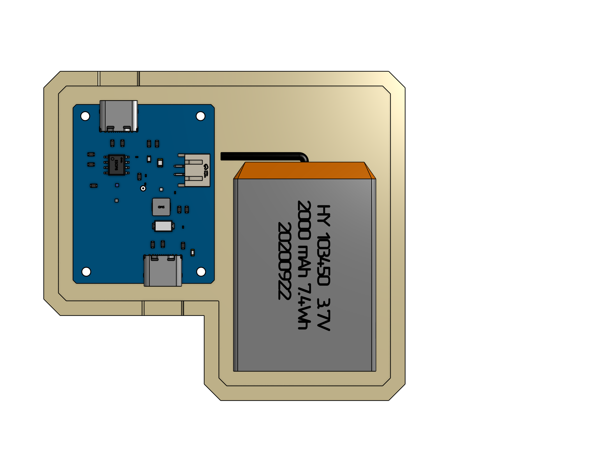
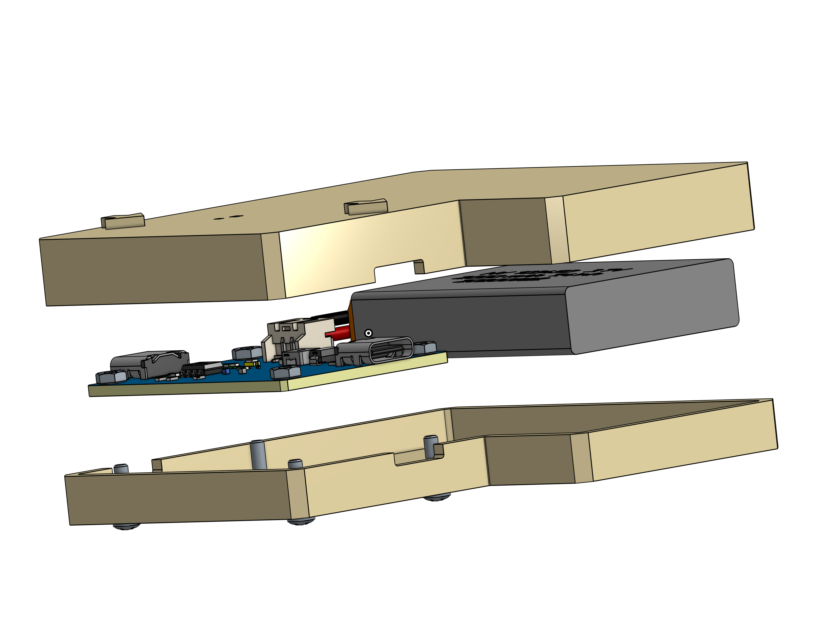
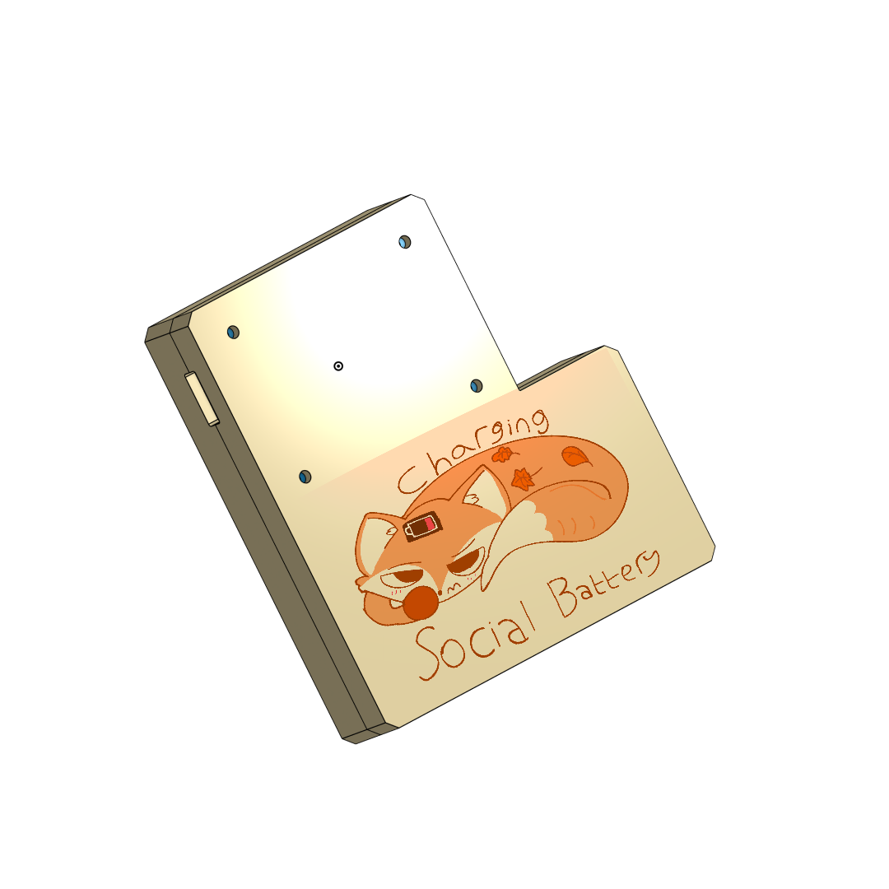
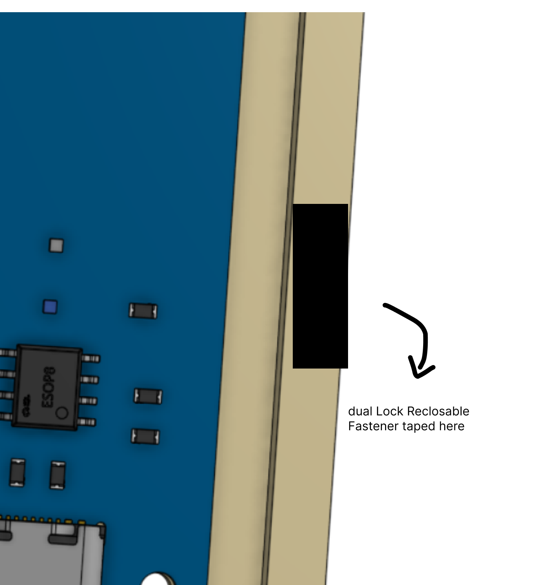

<div align="center">

<!-- Zine -->
<a href="zine/zine.png">
  
</a>

---

# Long Cat & FoxCharge

**A custom ESP32-C6 retro game console + fox-themed powerbank, built from scratch.**  
*By Nabeel — 18, Indonesia*

```
   /\_____/\
  /  o   o  \
 ( ==  ^  == )
```

</div>

---

## What Is This?

Long Cat is a handheld retro game console built around a custom ESP32-C6 PCB, put inside a 3D-printed enclosure featuring a long, stoopid cat on the back. It has a 1.3" OLED screen, 5 interface buttons, and a passive buzzer.

FoxCharge is its companion: a fox-themed powerbank with its own custom PCB, and a "Charging Social Battery" label on the back — totally relateable.

---

## Why Does This Exist?
The whole thing exists because I wanted a device where anyone could write their own retro-style game in firmware and actually play it on real hardware! A customizable silly looking project.

---

## How To Use It

### Coding & Flashing

This is the main loop. Open up Arduino IDE, write your game, and flash it to the console over USB-C.

1. Install [Arduino IDE](https://www.arduino.cc/en/software) and add ESP32 board support
2. Plug the console into your PC via USB-C
3. Open or write your game sketch
4. Select the correct board: **ESP32C6 Dev Module**
5. Hit upload, watch it flash, iterate :D

The enclosure pops open magnetically so you never need to unscrew anything to get to the board.

### Playing & Sharing

Once your game is ready and you want to take it somewhere — or just not be tethered to a laptop:

1. Plug the console into the **FoxCharge powerbank** via USB-C
2. The console powers up from the powerbank's 5V output
3. Hand it to a friend. Or play it yourself.

### Modifying the Hardware

Want to tweak the circuit? Change a pin assignment? Add something new? Here's where to go:

- **Console PCB** — open `PCB/board/board.kicad_pro` in [KiCad](https://www.kicad.org/). The schematic, layout, and production files are all in there.
- **FoxCharge PCB** — open `PCB/powerbank/powerbank.epro` in [EasyEDA](https://easyeda.com/). The Interactive BOM HTML (`PCB/powerbank/INTERACTIVE BOM/InteractiveBOM_PCB1_2026-5-30.html`) is very helpful for cross-referencing components on the board visually.

---

## Hardware Overview

### Console

The brain of Long Cat. Designed in KiCad, built around the ESP32-C6.

| Part | What it does |
|---|---|
| **ESP32-C6** | The microcontroller. RISC-V, Wi-Fi 6, BLE 5. Runs your game code. |
| **1.3" OLED** | The screen. I2C, connected on SDA/SCL. This is where everything gets drawn. |
| **5x Buttons** | `BTN_1` through `BTN_5` — your game inputs. Wired to dedicated GPIO pins. |
| **Passive Buzzer** | Makes noise. Driven by a transistor on `BUZZER_PIN`. Louder than what you'd expect!! |
| **Reset / Boot switches** | `SW1` = reset the board, `SW2` = enter bootloader. Useful during development. |
| **Debug header (J1)** | 6-pin header exposing EN, 3V3, TX, GND, RX, BOOT — for serial monitoring or alternate flashing setups. |

### FoxCharge Powerbank

The power source. Custom PCB designed in EasyEDA. Fox-themed. Sleeping fox on the front is load-bearing.

| Part | What it does |
|---|---|
| **Battery** | LiPo 103450 cell (~2000 mAh). |
| **Charge IC — TP4056** | Handles charging the LiPo safely from the USB-C input port. |
| **Boost IC — MT3608** | Steps up the battery voltage (~3.7V) to a stable 5V for the USB-C output. |
| **Protection IC — DW01A + FS8205A** | Protects the battery from overcharge, overdischarge, and short circuits. Keeps things from catching fire. |
| **USB-C Input** | Plug in a charger here to charge the battery. |
| **USB-C Output** | Plug the console here. This is what powers the game. |

---

## Assembly

### Long Cat Console

<p align="center">
  
  <br/>
  
  <br/>
  
</p>

The front and back halves of the enclosure are held together using **6 x 2mm neodymium magnets** on the edges. This means the case snaps shut cleanly and can be pulled apart for flashing or debugging without any tools — which matters a lot when you're iterating on your game code.

To secure the PCB inside the front half: use **M2 screws with nylon M2 nuts**. Nylon nuts ensures the PCB will be locked into the top of the enclosure. Full screw spec is in the BOM (`REAL_BOM/console.csv`).

The Long Cat sticker goes on the back and the Sleepy cat on the front. **This is not optional!!!**.

---

### FoxCharge Powerbank

<p align="center">
  
  <br/>
  
  <br/>
  
  <br/>
  
</p>

Inside the powerbank enclosure, the LiPo battery and PCB are separated using **padded EVA foam** to prevent contact, pressure damage, and general battery unhappiness.

On the inner edges, **Dual Lock Reclosable Fastener (24mm × 50cm Velcro-style)** is used to hold the assembly in place while still allowing it to be opened cleanly for battery replacement or inspection.
<p align="center">
  
</p>
Same M2 screw + nylon nut approach as the console for securing the PCB. See `REAL_BOM/powerbank.csv` for the full list.

---

## Repository Structure

```
.
├── PCB/
│   ├── board/                          # Console PCB (KiCad)
│   │   ├── board.kicad_pcb
│   │   ├── board.kicad_sch
│   │   ├── board.kicad_pro
│   │   ├── STEP/board.step
│   │   └── production/
│   │       ├── board_gerber.zip        # Send this to your fab
│   │       ├── netlist.ipc
│   │       ├── bom.csv-JLCPCB BOM Tool.xls
│   │       └── raw_bom.csv
│   └── powerbank/                      # FoxCharge PCB (EasyEDA)
│       ├── powerbank.epro
│       ├── powerbank_netlist.tel
│       ├── STEP/
│       ├── GERBER/powerbank_gerber.zip
│       └── INTERACTIVE BOM/
│           ├── BOM_Board1_PCB1_2026-05-30.xlsx
│           └── InteractiveBOM_PCB1_2026-5-30.html
├── enclosure/
│   ├── rawrenders/                     # Reference renders for assembly + zine
│   ├── console/
│   │   ├── enclosure_only.3mf          # Print this
│   │   ├── fullassemblyvisual.3mf      # Full assembly reference
│   │   └── fullassemblyvisual.step
│   └── powerbank/
│       ├── enclosure_only.3mf
│       ├── fullassemblyvisual.3mf
│       └── fullassemblyvisual.step
├── firmware/                           # Hello World for the console
├── stickers/
│   ├── longcat.png
│   ├── sleepcat.png
│   └── tiredfox.png
├── REAL_BOM/
│   ├── all.xlsx
│   ├── console.csv
│   ├── powerbank.csv
│   └── total.csv
└── zine/                               # Full project zine, PDF + PNG versions
```

---

## Stickers

Three stickers are included in `stickers/`. Print them on sticker paper and apply accordingly.

- `longcat.png` — The long, stoopid cat. Goes on the back of the console.
- `sleepcat.png` — Sleeping cat. Goes on the front of the console.
- `tiredfox.png` — The FoxCharge mascot. Goes on the powerbank.

---

## Zine

The `zine/` folder contains both a PDF and PNG version of the project zine, made for Fallout 2026. It's the fastest way to understand what this project is about.

---

## Firmware

An example given inside firmware folder. A simple mechanism to see OLED's output based on button presses. Use it as a starting point for your own games!

---

## OnShape Links
- [Check out the console enclosure](https://cad.onshape.com/documents/60f1f5947965f7d5a461c6ea/w/f31938c96fb582cd81c805fc/e/fdd6c70c168f7e2d293480c5?renderMode=0&uiState=6a1faab33bd1e6d24cdd9844)
- [Check out the powerbank enclosure](https://cad.onshape.com/documents/b2bd0c68b06dcbd9cb3796b5/w/1a262ecd5f3c2cdca41969fa/e/07a6aa8a28141834d2369848?renderMode=0&uiState=6a1faae954f1b396560d079b)

## Bill of Materials

Full BOM is split by subsystem for easier ordering, here are the BOM links:

| File | Contents |
|---|---|
| [`REAL_BOM/console.csv`](https://github.com/nabeellagi/LongCat/blob/main/REAL_BOM/console.csv) | All console PCB components |
| [`REAL_BOM/powerbank.csv`](https://github.com/nabeellagi/LongCat/blob/main/REAL_BOM/powerbank.csv) | All powerbank PCB components |
| [`REAL_BOM/all.xlsx`](https://github.com/nabeellagi/LongCat/blob/main/REAL_BOM/all.xlsx) | Combined, formatted |
| [`REAL_BOM/total.csv`](https://github.com/nabeellagi/LongCat/blob/main/REAL_BOM/total.csv) | Grand total cost summary |

Additional BOM :

1. `PCB/board/production/bom.csv-JLCPCB BOM Tool.xls`  is JLCPCB-formatted, ready to upload 
2. For the powerbank PCB, the Interactive BOM HTML (`PCB/powerbank/INTERACTIVE BOM/InteractiveBOM_PCB1_2026-5-30.html`) is the friendliest way to cross-reference components with their board placement.

### Console BOM
 
| # | Item | Description | Qty | Unit ($) | Total ($) | Link |
|---|---|---|---|---|---|---|
| 1 | ESPRESSIF ESP32-C6-WROOM-1-N8 | ESP32 Chip | 1 | 4.3546 | 4.3546 | [LCSC](https://www.lcsc.com/product-detail/C5366877.html) |
| 2 | TECH PUBLIC TPESD9B3.3ST5G | Diode | 3 | 0.0396 | 0.1188 | [LCSC](https://www.lcsc.com/product-detail/C2682285.html) |
| 3 | TECH PUBLIC USBLC6-2SC6 | Transient Voltage Suppressor | 1 | 0.041 | 0.041 | [LCSC](https://www.lcsc.com/product-detail/C2827654.html) |
| 4 | BZCN TSC016A04518A | Tactile Switches (console buttons) | 5 | 0.0107 | 0.0535 | [LCSC](https://www.lcsc.com/product-detail/C2888493.html) |
| 5 | TI LM1117MP-3.3 | Voltage Regulator | 1 | 0.2975 | 0.2975 | [LCSC](https://www.lcsc.com/product-detail/C3750685.html) |
| 6 | XHXDZ 1207-P6.5MM | Buzzer | 1 | 0.0316 | 0.0316 | [LCSC](https://www.lcsc.com/product-detail/C49246964.html) |
| 7 | 1N5817W | Diode Schottky | 1 | 0.0197 | 0.0197 | [LCSC](https://www.lcsc.com/product-detail/C727113.html) |
| 8 | MMBT2222A | Bipolar Transistor | 1 | 0.0155 | 0.0155 | [LCSC](https://www.lcsc.com/product-detail/C7420351.html) |
| 9 | HS HS13L03W2C01 | 1.3" OLED | 1 | 5.3558 | 5.3558 | [LCSC](https://www.lcsc.com/product-detail/C7465997.html) |
| 10 | muRata BLM21PG220SN1D | Ferrite Bead | 1 | 0.0308 | 0.0308 | [LCSC](https://www.lcsc.com/product-detail/C88993.html) |
| 11 | Resistor 1kΩ | R6 | 1 | 0.0011 | 0.0011 | [LCSC](https://www.lcsc.com/product-detail/C11702.html) |
| 12 | Capacitor 100nF | C2, C5 | 2 | 0.0016 | 0.0032 | [LCSC](https://www.lcsc.com/product-detail/C1525.html) |
| 13 | Capacitor 1uF | C3, C4 | 2 | 0.0098 | 0.0196 | [LCSC](https://www.lcsc.com/product-detail/C15849.html) |
| 14 | Korean Hroparts TYPE-C-31-M-12 | USB-C Input | 1 | 0.1725 | 0.1725 | [LCSC](https://www.lcsc.com/product-detail/C165948.html) |
| 15 | Capacitor 10uF | C1 | 1 | 0.25 | 0.25 | [LCSC](https://www.lcsc.com/product-detail/C19702.html) |
| 16 | B3U-1000P | ESP32 Buttons | 3 | 0.1781 | 0.5343 | [LCSC](https://www.lcsc.com/product-detail/C231329.html) |
| 17 | Resistor 2.2kΩ | R7, R8 | 2 | 0.0008 | 0.0008 | [LCSC](https://www.lcsc.com/product-detail/C25879.html) |
| 18 | Resistor 5.1kΩ | R4, R5 | 2 | 0.0009 | 0.0018 | [LCSC](https://www.lcsc.com/product-detail/C25905.html) |
| 19 | Capacitor 22uF | C6, C7 | 2 | 0.0618 | 0.1236 | [LCSC](https://www.lcsc.com/product-detail/C45783.html) |
| 20 | R+O SMD1206-050-30 | Reset Fuse | 1 | 0.0599 | 0.0599 | [LCSC](https://www.lcsc.com/product-detail/C46641016.html) |
| 21 | ZHOURI 2.54-2*3 | Pin Header | 1 | 0.0562 | 0.0562 | [LCSC](https://www.lcsc.com/product-detail/C5116479.html) |
| 22 | Resistor 10kΩ | R1, R2, R3 | 3 | 0.0009 | 0.0027 | [LCSC](https://www.lcsc.com/product-detail/C60490.html) |
| 23 | 6×2mm Neodymium Magnet | Enclosure attach/detach | 6 | 0.053 | 0.318 | [Tokopedia](https://tk.tokopedia.com/ZSxcDM12f/) |
| 24 | M2×8 Screw | Screw PCB to enclosure | 4 | 0.05 | 0.20 | [Tokopedia](https://tk.tokopedia.com/ZSxcDKrx9/) |
| 25 | M2 Nylon Nut | Lock the screw | 4 | 0.054 | 0.216 | [Tokopedia](https://tk.tokopedia.com/ZSxcP4PVw/) |
 
**Console total: ~$12.28**

---

### FoxCharge Powerbank BOM
 
| # | Item | Description | Qty | Unit ($) | Total ($) | Link |
|---|---|---|---|---|---|---|
| 1 | TPOWER TP4056 | Charging Module | 1 | 0.1194 | 0.1194 | [LCSC](https://www.lcsc.com/product-detail/C382139.html) |
| 2 | PUOLOP DW01A | Battery Protection (overcharge prevention) | 1 | 0.0428 | 0.0428 | [LCSC](https://www.lcsc.com/product-detail/C351410.html) |
| 3 | XI'AN Aerosemi Tech MT3608 | Boost Step-Up Regulator | 1 | 0.0786 | 0.0786 | [LCSC](https://www.lcsc.com/product-detail/C84817.html) |
| 4 | TECH PUBLIC FS8205A | LiPo Battery Protection FET | 1 | 0.0575 | 0.0575 | [LCSC](https://www.lcsc.com/product-detail/C2830320.html) |
| 5 | SHOU HAN TYPE-C 16PIN 2MD(073) | USB-C Input and Output | 2 | 0.0742 | 0.1484 | [LCSC](https://www.lcsc.com/product-detail/C2765186.html) |
| 6 | Hubei KENTO KT-0603R | Red LED | 1 | 0.007 | 0.007 | [LCSC](https://www.lcsc.com/product-detail/C2286.html) |
| 7 | Hubei KENTO KT-0805G | Green LED | 1 | 0.0163 | 0.0163 | [LCSC](https://www.lcsc.com/product-detail/C2297.html) |
| 8 | EVERLIGHT 19-213/BHC-ZL1M2RY/5T | Blue LED | 1 | 0.0381 | 0.0381 | [LCSC](https://www.lcsc.com/product-detail/C2987539.html) |
| 9 | cjiang FXL0420-4R7-M | Inductor 4.7µH | 1 | 0.2076 | 0.2076 | [LCSC](https://www.lcsc.com/product-detail/C167208.html) |
| 10 | JST S2B-PH-SM4-TB(LF)(SN) | JST Pin for Battery | 1 | 0.204 | 0.204 | [LCSC](https://www.lcsc.com/product-detail/C295747.html) |
| 11 | LiPo 104050 2000mAh 3.7V | Battery | 1 | 4.83 | 4.83 | [Tokopedia](https://tk.tokopedia.com/ZSxtYCQTL/) |
| 12 | Resistor 5.1kΩ | R1, R2 | 2 | 0.0003 | 0.0006 | [LCSC](https://www.lcsc.com/product-detail/C23186.html) |
| 13 | Resistor 470Ω | R3, R4 | 2 | 0.0003 | 0.0006 | [LCSC](https://www.lcsc.com/product-detail/C23179.html) |
| 14 | Resistor 10kΩ | R5 | 1 | 0.0003 | 0.0003 | [LCSC](https://www.lcsc.com/product-detail/C25804.html) |
| 15 | Resistor 1.2kΩ | R6 | 1 | 0.0003 | 0.0003 | [LCSC](https://www.lcsc.com/product-detail/C114605.html) |
| 16 | Resistor 1kΩ | R7, R12 | 2 | 0.0003 | 0.0006 | [LCSC](https://www.lcsc.com/product-detail/C22548.html) |
| 17 | Resistor 110kΩ | R8 | 1 | 0.0002 | 0.0002 | [LCSC](https://www.lcsc.com/product-detail/C25805.html) |
| 18 | Resistor 15kΩ | R9 | 1 | 0.0003 | 0.0003 | [LCSC](https://www.lcsc.com/product-detail/C114661.html) |
| 19 | Resistor 56kΩ | R10, R11 | 2 | 0.0003 | 0.0006 | [LCSC](https://www.lcsc.com/product-detail/C23206.html) |
| 20 | Resistor 100Ω | R13 | 1 | 0.0003 | 0.0003 | [LCSC](https://www.lcsc.com/product-detail/C105588.html) |
| 21 | Capacitor 10uF | C1, C2 | 2 | 0.0019 | 0.0038 | [LCSC](https://www.lcsc.com/product-detail/C19702.html) |
| 22 | Capacitor 22uF | C3, C4 | 2 | 0.0027 | 0.0054 | [LCSC](https://www.lcsc.com/product-detail/C86295.html) |
| 23 | Capacitor 100nF | C6 | 1 | 0.0003 | 0.0003 | [LCSC](https://www.lcsc.com/product-detail/C160831.html) |
| 24 | 3M Dual Lock Fastener 24mm×50cm | Enclosure attach/detach (use 3mm×3mm pieces) | 6 | 0.001 | 0.006 | [Tokopedia](https://tk.tokopedia.com/ZSxcDnUcT/) |
| 25 | M2×8 Screw | Screw PCB to enclosure | 4 | 0.05 | 0.20 | [Tokopedia](https://tk.tokopedia.com/ZSxcDKrx9/) |
| 26 | M2 Nylon Nut | Lock the screw | 4 | 0.054 | 0.216 | [Tokopedia](https://tk.tokopedia.com/ZSxc5xuDv/) |
 
**Powerbank total: ~$6.19**
 
---